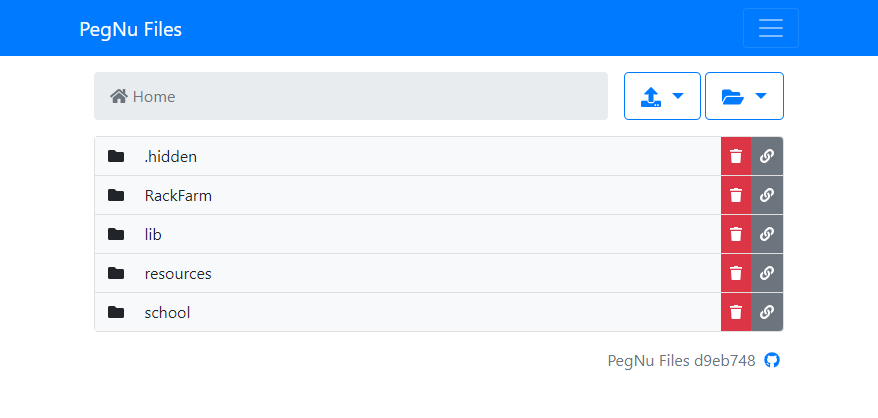

# PegNu Files

Public file browser and manager

## Description

PegNu Files is based on:

- Spring Boot
- Spring MVC + Thymeleaf
- Bootstrap 4

Signed-in screenshot (mobile):



## Getting Started

### Dependencies

PegNu Files requires:

- A Keycloak instance to authenticate against. Local user storage is not supported.
- Webserver for downloads. PegNu Files does not provide downloads itself.

### Installing

You can grab the latest docker image from the GitHub container registry:

```shell
docker pull ghcr.io/jmesserli/pegnu-files:latest
```

### Executing program

The recommended way of deploying PegNu Files is using docker-compose. You can refer to the following example
configuration, and adapt it to your needs:

```yaml
version: "3.8"

services:
  files:
    image: ghcr.io/jmesserli/pegnu-files:latest
    restart: unless-stopped

    environment:
      KEYCLOAK_CLIENT_ID: <client>
      KEYCLOAK_CLIENT_SECRET: <secret>
      # Keycloak Base Url, e.g https://id.peg.nu - without /auth
      KEYCLOAK_BASE: <keycloak base url>
      KEYCLOAK_REALM: <keycloak realm>

      PFS_LISTING_BASE: /pegnu-files-data
      PFS_DOWNLOAD_BASE: https://cdn.peg.nu/files
      PFS_WEB_BASE: https://files.peg.nu

    volumes:
      - /var/www/html/.../files:/pegnu-files-data

    ports:
      - 10009:8080

    labels:
      # If you use watchtower for "deployment"
      com.centurylinklabs.watchtower.enable: true
```

The easiest way to keep PegNu Files up-to-date is by using watchtower.

### Configuration

Configurable through environment variables:

| Environment Variable    | Description                                     |       Default Value        |
| ----------------------- | ----------------------------------------------- | :------------------------: |
| SPRING_MAX_FILE_SIZE    | Max upload file size                            |            50M             |
| SPRING_MAX_REQUEST_SIZE | Max request size                                |            51M             |
| KEYCLOAK_REALM          | Keycloak realm                                  |                            |
| KEYCLOAK_BASE           | Keycloak base url without /auth                 |                            |
| KEYCLOAK_CLIENT_ID      | Keycloak OAuth2 client id                       |                            |
| KEYCLOAK_CLIENT_SECRET  | Keycloak OAuth2 client secret                   |                            |
| PFS_LISTING_BASE        | Directory to show on the web interface          |     /pegnu-files-data      |
| PFS_DOWNLOAD_BASE       | Base URL for downloads (CDN URL / nginx / etc.) | http://localhost:8888/test |
| PFS_WEB_BASE            | Base URL for the web interface                  |   http://localhost:8080    |
| PFS_ANALYTICS_SNIPPET   | Snippet to be added to the head                 |                            |

### Keycloak Roles

The following Keycloak roles can be used to control access to PegNu Files

| Role                       | Permissions                                          |
| -------------------------- | ---------------------------------------------------- |
| PegNu-Files.ADMIN          | Composite role of all other roles<br>All permissions |
| PegNu-Files.ALLOW          | Unused                                               |
| PegNu-Files.DELETE         | Delete files and directories                         |
| PegNu-Files.MAKE-DIRECTORY | Create directories                                   |
| PegNu-Files.SEE-HIDDEN     | See hidden files and directories (prefixed with .)   |
| PegNu-Files.UPLOAD         | Upload files to directories                          |

## Authors

- [Joel Messerli](https://keybase.io/jmesserli)

## License

This project is licensed under the MIT License - see the LICENSE file for details
